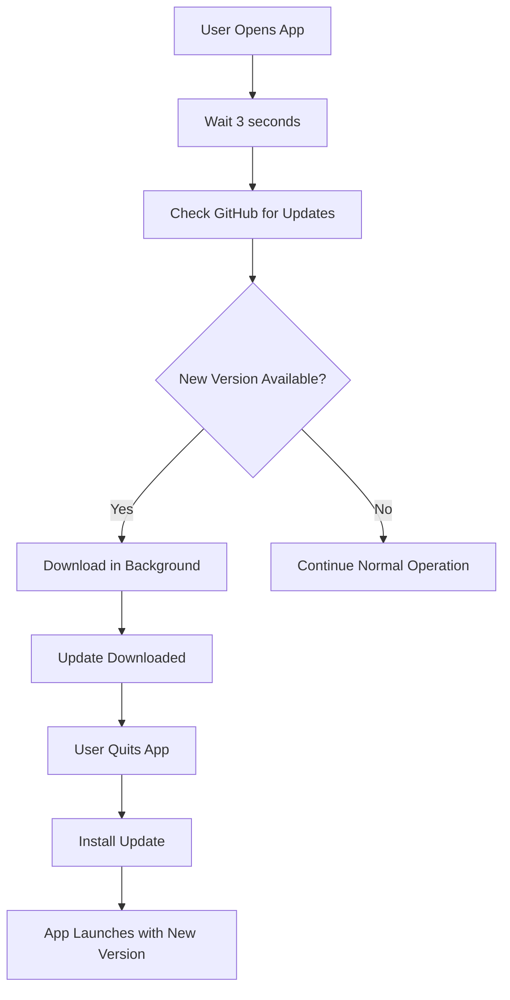

# ✅ Auto-Update Implementation Complete!

## What Was Implemented

Your Sweesh app now has **fully functional auto-updates** using GitHub Releases!

### 🎯 Features Implemented:

1. **Automatic Update Checks**
   - Checks for updates 3 seconds after app start
   - Uses GitHub Releases as update server
   - Works on Windows, macOS, and Linux

2. **Automatic Download & Install**
   - Downloads updates in the background
   - Installs automatically when app quits
   - No user intervention needed

3. **Comprehensive Logging**
   - All update activity logged with electron-log
   - Easy debugging with detailed logs
   - Logs location: `%APPDATA%\sweesh\logs\main.log`

4. **UI Integration Ready**
   - Update status events sent to renderer
   - Can display update notifications
   - Progress tracking available

5. **Development Mode Safety**
   - Auto-updater disabled in development
   - Prevents accidental updates while coding

## 📦 Files Modified

### Configuration
- ✅ `package.json` - Added GitHub publish settings
  ```json
  "publish": [{
    "provider": "github",
    "owner": "hasin-codes",
    "repo": "sweesh.exe"
  }]
  ```

### Implementation
- ✅ `src/main.ts` - Auto-updater setup with events
- ✅ `src/preload.ts` - Exposed update APIs to renderer
- ✅ `src/types/electron.d.ts` - TypeScript definitions

### Scripts
- ✅ `npm run release` - Build and publish to GitHub

### Documentation
- ✅ `AUTO_UPDATE_SETUP.md` - Complete setup guide
- ✅ `QUICK_START_AUTO_UPDATE.md` - Quick reference

## 🚀 Next Steps (Required)

### To Enable Auto-Updates:

#### 1. Create GitHub Personal Access Token
```
📍 https://github.com/settings/tokens/new

Settings:
- Note: Sweesh Auto-Updater
- Expiration: 90 days
- Scope: ✅ repo

Click "Generate token" and copy it!
```

#### 2. Set Environment Variable
```powershell
# Windows (PowerShell)
[Environment]::SetEnvironmentVariable("GH_TOKEN", "your_token_here", "User")

# RESTART your terminal/IDE after this!
```

#### 3. Verify Token
```powershell
# After restarting terminal
echo $env:GH_TOKEN
# Should show your token
```

#### 4. Build & Publish First Release
```bash
# Make sure package.json has "version": "1.0.0"
npm run release
```

#### 5. Publish on GitHub
```
📍 https://github.com/hasin-codes/sweesh.exe/releases
- Find the draft release
- Click "Publish release"
```

## 🔄 How It Works



### Update Flow:
1. **App Start** → Auto-updater checks GitHub
2. **New Version Found** → Download automatically
3. **Download Complete** → Ready to install
4. **User Quits App** → Update installs
5. **Next Launch** → User has latest version

## 📊 Update Events

Your app now emits these events:

| Event | When | Data |
|-------|------|------|
| `checking` | Checking for updates | - |
| `available` | Update found | `version` |
| `downloading` | Downloading | `progress` |
| `downloaded` | Ready to install | `version` |
| `not-available` | No updates | - |
| `error` | Error occurred | `error` |

## 🎨 UI Integration Example

Add update notifications to your UI:

```typescript
// In your React component
useEffect(() => {
  const handleUpdate = (data: any) => {
    if (data.status === 'downloaded') {
      // Show notification: "Update ready! Restart to install v1.0.1"
      toast.success(`Update ready! Restart to install v${data.version}`);
    }
  };

  window.electronAPI.onUpdateStatus(handleUpdate);
  return () => window.electronAPI.removeUpdateListener();
}, []);
```

## 🧪 Testing Updates

### Test Scenario:
1. Build v1.0.0 → `npm run release`
2. Publish on GitHub
3. Install v1.0.0 from releases
4. Update to v1.0.1 in package.json
5. Build v1.0.1 → `npm run release`
6. Publish on GitHub
7. Run installed v1.0.0 app
8. **Watch it auto-update to v1.0.1!** 🎉

### Check Logs:
```
Windows: %APPDATA%\sweesh\logs\main.log

You should see:
- "Checking for updates..."
- "Update available: 1.0.1"
- "Download progress: 100%"
- "Update downloaded"
```

## 📋 Version Bump Guide

When releasing a new version:

```bash
# 1. Update version in package.json
# Bug fixes: 1.0.0 → 1.0.1
# New features: 1.0.0 → 1.1.0
# Breaking changes: 1.0.0 → 2.0.0

# 2. Build and publish
npm run release

# 3. Go to GitHub and publish the draft release
```

## 🔒 Important Notes

### Code Signing (macOS)
- macOS apps **MUST** be signed for auto-updates
- Windows code signing is recommended but optional

### Version Numbering
- Always increment version (never reuse)
- Use semantic versioning: `MAJOR.MINOR.PATCH`
- Example: `1.0.0` → `1.0.1` → `1.1.0` → `2.0.0`

### GitHub Releases
- Each release must include the `.yml` metadata files
- electron-builder uploads these automatically
- Don't delete or modify these files manually

## 🎯 Your Repository

**GitHub Repo**: https://github.com/hasin-codes/sweesh.exe
**Releases**: https://github.com/hasin-codes/sweesh.exe/releases

## 📚 Documentation

| File | Purpose |
|------|---------|
| `AUTO_UPDATE_SETUP.md` | Complete setup guide with troubleshooting |
| `QUICK_START_AUTO_UPDATE.md` | Quick reference guide |
| `AUTO_UPDATE_COMPLETE.md` | This file - implementation summary |

## ✅ Verification Checklist

Before releasing:

- [ ] GitHub token created
- [ ] `GH_TOKEN` environment variable set
- [ ] Terminal/IDE restarted
- [ ] Token verified with `echo $env:GH_TOKEN`
- [ ] Version set in package.json
- [ ] `npm run release` successful
- [ ] Draft release published on GitHub
- [ ] App installed and tested
- [ ] Update check works in logs

## 🎉 Success Criteria

You'll know it's working when:

1. **Logs show**: "Checking for updates..."
2. **New version found**: "Update available: X.X.X"
3. **Download completes**: "Update downloaded"
4. **After quit**: App relaunches with new version

## 🆘 Common Issues

### Token Not Working?
```powershell
# Re-set the token
[Environment]::SetEnvironmentVariable("GH_TOKEN", "your_token", "User")
# RESTART terminal/IDE
```

### Updates Not Detected?
- Check version number is higher than installed version
- Check GitHub release is published (not draft)
- Check logs for errors

### Build Fails?
```bash
# Clean and rebuild
npm run clean
npm run rebuild
npm run release
```

## 🎓 Learn More

- [electron-updater Docs](https://www.electron.build/auto-update.html)
- [GitHub Releases Guide](https://docs.github.com/en/repositories/releasing-projects-on-github)
- [Semantic Versioning](https://semver.org/)

---

## 🎯 Summary

✅ **Auto-updates configured and ready!**

Your app will now:
1. Check for updates on every launch
2. Download updates automatically
3. Install on app quit
4. Keep users on the latest version

**Just follow the "Next Steps" above to set up your GitHub token and publish your first release!**

Total setup time: ~15 minutes ⏱️

Good luck with your releases! 🚀

